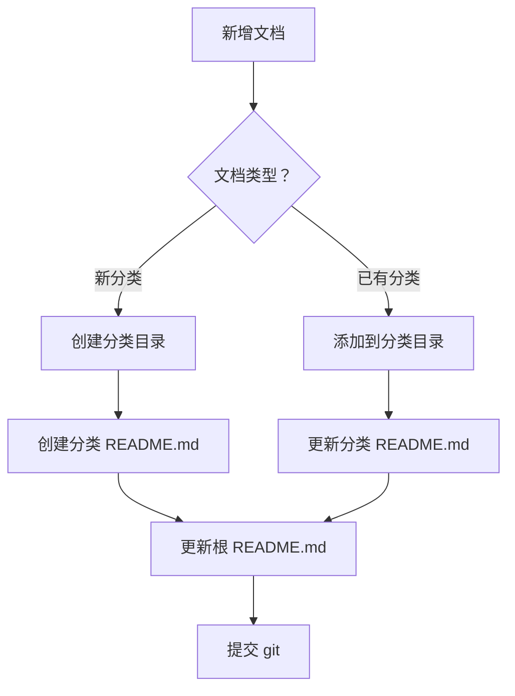

# docs 目录命名与 README 维护规范

## 一、目录和文件命名规范

### 1.1 核心原则

**所有目录和文件名称中禁止包含空格**

### 1.2 命名格式标准

#### ✅ 正确示例

```
docs/
├── 01-Java基础/
│   ├── 01-等于与 equals.md
│   ├── 02-String详解.md
│   └── README.md
├── 02-Java并发编程/
├── 03-JVM/
├── 04-Spring框架/
├── 05-SpringBoot 与自动装配/
├── 06-SpringCloud 微服务/
├── 07-MySQL数据库/
├── 08-Redis 缓存/
├── 09-中间件/
├── 10-算法与数据结构/
├── 11-设计模式/
├── 12-分布式系统/
└── 13-DevOps/
```

#### ❌ 错误示例

```
docs/
├── 04-Spring框架 /          # ❌ 包含空格
├── 07-MySQL数据库/          # ❌ 包含空格
├── 09-中间件/
│   ├── 06-RPC核心原理与实战指南.md  # ❌ 包含空格
│   └── 04-Nacos核心知识点详解.md    # ❌ 包含空格
```

### 1.3 命名规则详细说明

#### 目录命名规则

1. **一级分类目录**：`序号 - 分类名称`
    - 使用中文连字符 `-` 分隔
    - 序号使用两位数字（01, 02, 03...）
    - 分类名称简洁明了
    - **禁止包含空格**

2. **二级分类目录**（如有需要）：同样遵循上述规则

#### 文件命名规则

1. **Markdown 文档**：`序号 - 文档标题.md`
    - 序号使用两位数字
    - 标题简洁明了
    - 使用中文连字符 `-` 分隔单词
    - **禁止包含空格**

2. **特殊文件**：
    - `README.md` - 每个分类目录下的说明文件
    - 保持小写

---

## 二、README.md 同步更新规范

### 2.1 核心要求

**每新增一个目录或文件，必须同步更新对应的 README.md 文档**

### 2.2 更新层级

#### 1. 根目录 README.md

**位置：** `docs/README.md`

**更新内容：**

- 所有一级分类目录的导航
- 每个分类的文档数量统计
- 最新更新记录

**示例结构：**

```markdown
# 技术文档导航

## 文档分类

| 序号 | 分类 | 文档数 | 说明 |
|------|------|--------|------|
| 01 | [Java基础](01-Java基础/) | 10 | Java 语言基础、面向对象、泛型、反射等 |
| 02 | [Java并发编程](02-Java并发编程/) | 8 | 线程池、锁机制、AQS、并发工具等 |
| ... | ... | ... | ... |

## 最新更新

- 2026-03-08: 新增《RPC核心原理与实战指南》
- 2026-03-08: 新增《Spring事务完全指南》
- ...
```

#### 2. 分类目录 README.md

**位置：** `docs/分类名称/README.md`

**更新内容：**

- 本分类下所有文档的列表
- 每个文档的简要说明
- 重点知识点标注

**示例结构：**

```markdown
# Spring框架技术文档

## 文档列表

| 序号 | 文档标题 | 核心内容 | 面试题数 |
|------|---------|---------|---------|
| 01 | [Spring IOC 与 AOP](01-Spring-IOC 与 AOP.md) | IOC 容器、依赖注入、AOP 原理 | 8 |
| 02 | [Spring Bean生命周期详解](02-Spring-Bean生命周期详解.md) | Bean 创建、初始化、销毁流程 | 10 |
| 06 | [Spring事务完全指南](06-Spring事务完全指南.md) | 事务失效、传播行为、隔离级别 | 8 |

## 知识体系

- **核心概念**：IOC、AOP、Bean 管理
- **高级特性**：事务管理、MVC 框架、自动装配
- **最佳实践**：配置优化、性能调优
```

### 2.3 更新流程



### 2.4 自动化检查脚本

```python
import os
import glob

def check_docs_structure():
    """检查 docs 目录结构规范性"""
    
    issues = []
    
    # 检查所有目录和文件名是否包含空格
    for root, dirs, files in os.walk('docs'):
        # 检查目录名
        for dir_name in dirs:
            if ' ' in dir_name:
                rel_path = os.path.relpath(os.path.join(root, dir_name), 'docs')
                issues.append(f"目录名包含空格：{rel_path}")
        
        # 检查文件名
        for file_name in files:
            if file_name.endswith('.md') and ' ' in file_name:
                rel_path = os.path.relpath(os.path.join(root, file_name), 'docs')
                issues.append(f"文件名包含空格：{rel_path}")
    
    # 检查 README.md 是否存在
    readme_files = glob.glob('docs/**/README.md', recursive=True)
    print(f'找到 {len(readme_files)} 个 README.md 文件')
    
    if issues:
        print('\n发现问题:')
        for issue in issues:
            print(f'  ❌ {issue}')
    else:
        print('\n✅ 目录结构规范，无空格问题')
    
    return len(issues) == 0

if __name__ == '__main__':
    check_docs_structure()
```

---

## 三、执行清单

### 3.1 新增文档时的必做事项

- [ ] 
    1. 检查目录名是否包含空格
- [ ] 
    2. 检查文件名是否包含空格
- [ ] 
    3. 创建或更新分类目录的 README.md
- [ ] 
    4. 更新根目录的 README.md
- [ ] 
    5. 在根 README.md 中添加更新记录
- [ ] 
    6. 提交 git 时包含 README 更新

### 3.2 定期维护事项

- [ ] 每月检查一次目录结构
- [ ] 清理包含空格的旧目录
- [ ] 确保所有分类都有 README.md
- [ ] 更新文档统计数据

---

## 四、模板示例

### 4.1 分类目录 README.md 模板

```markdown
# {分类名称}技术文档

## 文档列表

| 序号 | 文档标题 | 核心内容 | 面试题数 | 状态 |
|------|---------|---------|---------|------|
| 01 | [文档 1](01-文档 1.md) | 核心知识点 1 | 8 | ✅ |
| 02 | [文档 2](02-文档 2.md) | 核心知识点 2 | 10 | ✅ |

## 知识体系

- **基础概念**：...
- **核心原理**：...
- **高级特性**：...
- **最佳实践**：...

## 学习路径

1. 从基础概念开始
2. 理解核心原理
3. 掌握高级特性
4. 应用最佳实践

## 参考资料

- [官方文档]()
- [相关书籍]()
```

### 4.2 根目录 README.md 模板

```markdown
# 技术文档导航

## 📚 文档分类

| 序号 | 分类 | 文档数 | 说明 | 最近更新 |
|------|------|--------|------|---------|
| 01 | [Java基础](01-Java基础/) | 10 | Java 语言基础、面向对象、泛型、反射等 | 2026-03-08 |
| 02 | [Java并发编程](02-Java并发编程/) | 8 | 线程池、锁机制、AQS、并发工具等 | 2026-03-07 |
| 03 | [JVM](03-JVM/) | 2 | JVM 内存模型、垃圾回收、性能调优 | 2026-03-05 |
| 04 | [Spring框架](04-Spring框架/) | 6 | IOC、AOP、事务、MVC、Bean生命周期 | 2026-03-08 |
| ... | ... | ... | ... | ... |

## 🔥 最新更新

- 2026-03-08: 
  - 新增《RPC核心原理与实战指南》（8 道面试题）
  - 新增《Spring事务完全指南》（8 道面试题）
  - 统一面试题目格式规范
- 2026-03-07: 
  - 新增《高并发线程安全详解》
  - 更新《线程池详解》面试题目

## 📊 统计信息

- **总文档数**: XX
- **总面试题数**: XXX
- **覆盖技术栈**: Java、Spring、MySQL、Redis、微服务等

## 🎯 使用建议

1. **按分类学习** - 选择一个技术方向系统性学习
2. **针对性复习** - 根据面试题定位相关文档
3. **实践为主** - 运行示例代码，加深理解

## 📝 文档规范

- 所有目录和文件名不包含空格
- 每个分类都有 README.md
- 面试题目统一格式
- 定期更新维护

---

**维护者**: itzixiao  
**最后更新**: 2026-03-08
```

---

## 五、历史问题处理

### 5.1 现有空格问题清理计划

**第一阶段：识别问题**

```bash
# 查找所有包含空格的目录和文件
find docs -name "* *" -type d
find docs -name "* *" -type f
```

**第二阶段：备份数据**

```bash
# 创建备份
cp -r docs docs_backup_$(date +%Y%m%d)
```

**第三阶段：批量重命名**

```python
import os

def remove_spaces_in_names(root_dir):
    """批量移除目录和文件名中的空格"""
    for root, dirs, files in os.walk(root_dir, topdown=False):
        # 重命名目录
        for dir_name in dirs:
            if ' ' in dir_name:
                old_path = os.path.join(root, dir_name)
                new_name = dir_name.replace(' ', '')
                new_path = os.path.join(root, new_name)
                os.rename(old_path, new_path)
                print(f'目录重命名：{old_path} -> {new_path}')
        
        # 重命名文件
        for file_name in files:
            if ' ' in file_name:
                old_path = os.path.join(root, file_name)
                new_name = file_name.replace(' ', '')
                new_path = os.path.join(root, new_name)
                os.rename(old_path, new_path)
                print(f'文件重命名：{old_path} -> {new_path}')
```

**第四阶段：更新引用**

- 检查所有 Markdown 文件中的内部链接
- 更新因重命名而失效的链接

### 5.2 预防措施

1. **Git 钩子检查**
   ```bash
   # .git/hooks/pre-commit
   #!/bin/bash
   if git diff --cached --name-only | grep -q ' '; then
       echo "❌ 检测到文件名包含空格，请修正后再提交"
       exit 1
   fi
   ```

2. **CI/CD检查**
    - 在 CI 流程中添加命名规范检查
    - 发现空格则构建失败

---

## 六、记忆保存

已将以下规范保存到项目记忆中：

1. **目录命名规范** - 禁止包含空格
2. **文件命名规范** - 禁止包含空格
3. **README 同步更新** - 新增文档必更新 README
4. **自动化检查** - Python 脚本定期检查

---

**版本**: 1.0  
**创建时间**: 2026-03-08  
**维护者**: itzixiao
