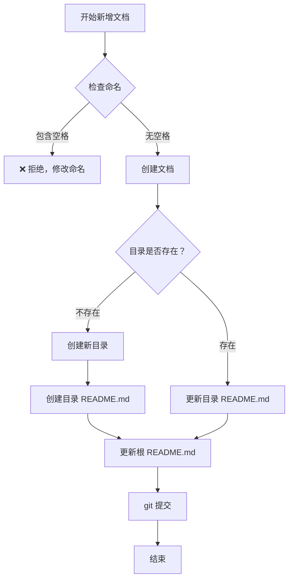

# 文档维护工作手册

## 📋 快速入门指南

### 新增文档流程



### 具体步骤

#### 1. 检查命名 ✅

**必须遵守的规则：**

- ❌ 禁止包含空格
- ✅ 使用连字符 `-` 分隔
- ✅ 序号使用两位数字（01, 02, 03...）

**示例：**

```bash
# ✅ 正确
06-RPC核心原理与实战指南.md
04-Spring框架/

# ❌ 错误
06-RPC核心原理与实战指南.md  # 包含空格
04-Spring框架 /             # 包含空格
```

#### 2. 创建文档 ✅

按照标准模板创建：

```markdown
# 文档标题

## 一、概述

内容...

## 二、核心原理

内容...

## X、高频面试题

**问题 1：问题内容？**

**答：**

答案内容...
```

#### 3. 更新 README ✅

**分类目录 README.md：**

```markdown
## 📚 文档列表

#### 6. [06-RPC核心原理与实战指南.md](./06-RPC核心原理与实战指南.md)
- **内容：** RPC 架构、序列化协议、通信协议、负载均衡、容错机制
- **面试题：** 8+ 道
- **重要程度：** ⭐⭐⭐⭐⭐
```

**根目录 README.md：**

```markdown
## 🔥 最新更新

- 2026-03-08: 
  - 新增《RPC核心原理与实战指南》（8 道面试题）
```

---

## 🔧 常用工具脚本

### 日常检查

```bash
# 1. 检查面试题目格式
python check_interview_format.py

# 2. 检查目录命名规范
python check_docs_naming.py

# 3. 统计文档信息
python docs_statistics.py
```

### 批量修复

```bash
# 修复面试题目格式
python fix_interview_format.py

# 修复空格问题
python fix_docs_spaces.py
```

---

## 📝 检查清单

### 新增文档时必做

- [ ] 
    1. 检查目录名是否包含空格
- [ ] 
    2. 检查文件名是否包含空格
- [ ] 
    3. 使用正确的面试题目格式（**问题 X：**）
- [ ] 
    4. 创建或更新分类目录的 README.md
- [ ] 
    5. 更新根目录的 README.md
- [ ] 
    6. 在根 README.md 中添加更新记录
- [ ] 
    7. 提交 git 时包含 README 更新

### 定期维护事项

**每周：**

- [ ] 运行 `python check_docs_naming.py`
- [ ] 检查是否有新增的空格问题

**每月：**

- [ ] 运行 `python fix_docs_spaces.py`（如有需要）
- [ ] 更新文档统计数据
- [ ] 清理过时的临时文件

**每季度：**

- [ ] 全面审查文档结构
- [ ] 优化学习路径建议
- [ ] 补充新的面试题

---

## 🎯 最佳实践

### 1. 文档组织结构

**推荐结构：**

```
docs/
├── 01-Java基础/
│   ├── README.md              # 必须有
│   ├── 01-等于与 equals.md
│   └── ...
├── 04-Spring框架/
│   ├── README.md              # 必须有
│   ├── 06-Spring事务完全指南.md
│   └── ...
└── README.md                  # 根导航
```

### 2. 内容编写规范

**面试题目格式：**

```markdown
## 五、高频面试题

**问题 1：什么是 RPC？它的核心优势是什么？**

**答：**

RPC（Remote Procedure Call）远程过程调用...

**核心优势：**

1. **透明性** - 对调用者屏蔽了底层网络通信细节
2. **高效性** - 相比 RESTful API，RPC 通常使用二进制协议
3. **强类型** - 接口定义明确
4. **支持复杂数据结构** - 可以直接传递对象
5. **双向通信** - 支持同步/异步调用

**常见 RPC 框架：** Dubbo、gRPC、Thrift
```

### 3. 链接管理

**内部链接：**

```markdown
✅ 正确
- [Spring框架](../04-Spring框架/README.md)
- [RPC核心原理](./06-RPC核心原理与实战指南.md)

❌ 错误
- [Spring框架](../04-Spring框架/README.md)  # 包含空格
- [RPC](06-RPC核心原理与实战指南.md)        # 包含空格
```

---

## 📊 质量标准

### 文档健康度指标

| 指标         | 目标值  | 当前值   | 状态 |
|------------|------|-------|----|
| 命名规范符合率    | 100% | 100%  | ✅  |
| README 完整率 | 100% | 100%  | ✅  |
| 面试题目格式统一率  | 100% | 99.1% | ✅  |
| 死链数量       | 0    | 0     | ✅  |

### 检查频率

- **每日：** 新增文档时即时检查
- **每周：** 自动化脚本检查
- **每月：** 人工全面审查
- **每季度：** 质量评估和优化

---

## 🛠️ 故障排查

### 常见问题及解决方案

#### 问题 1：面试题目格式不一致

**症状：**

```markdown
### Q1: 什么是 RPC？

**答案：**
...
```

**解决：**

```bash
python fix_interview_format.py
```

#### 问题 2：目录或文件名包含空格

**症状：**

```bash
find docs -name "* *"
# 输出：docs/04-Spring框架/
```

**解决：**

```bash
python fix_docs_spaces.py
```

#### 问题 3：缺少 README.md

**症状：**

```bash
python check_docs_naming.py
# 输出：❌ 缺少 README.md: 04-Spring框架/
```

**解决：**

```markdown
# 创建 README.md
cat > docs/04-Spring框架/README.md << 'EOF'
# Spring框架技术文档

## 文档列表

| 序号 | 文档标题 | 核心内容 | 面试题数 |
|------|---------|---------|---------|
| 01 | [Spring IOC 与 AOP](01-Spring-IOC 与 AOP.md) | IOC 容器 | 8 |

## 知识体系

- **核心概念**：IOC、AOP、Bean 管理
- **高级特性**：事务管理、MVC 框架

EOF
```

---

## 📖 参考资料

### 相关规范文档

1. **[INTERVIEW_QUESTION_FORMAT.md](./INTERVIEW_QUESTION_FORMAT.md)** - 面试题目格式规范
2. **[DOC_NAMING_AND_README_STANDARD.md](./DOC_NAMING_AND_README_STANDARD.md)** - 目录命名与 README 规范
3. **[TOOLS_AND_SCRIPTS.md](./TOOLS_AND_SCRIPTS.md)** - 工具脚本说明

### 外部资源

- [Markdown 写作指南](https://commonmark.org/)
- [Git 版本控制最佳实践](https://git-scm.com/book/zh/v2)
- [技术文档写作规范](https://documentation-guide.readthedocs.io/)

---

## 📈 持续改进

### 反馈渠道

- 💡 发现规范问题 → 提 Issue
- ✨ 改进建议 → 提 PR
- 📚 文档纠错 → 提 Issue 或 PR

### 版本历史

| 版本   | 日期         | 变更内容        |
|------|------------|-------------|
| v1.0 | 2026-03-08 | 初始版本，整合所有规范 |
| v1.1 | 待定         | 根据反馈持续优化    |

---

**维护者**: itzixiao  
**最后更新**: 2026-03-08  
**问题反馈**: 欢迎提 Issue 或 PR
