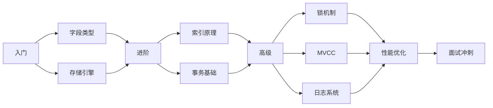

# MySQL 技术文档索引

## 📚 文档清单

本项目包含完整的 MySQL 技术文档体系，以下是所有 MySQL 相关文档的快速索引：

---

## 🎯 核心文档（4 篇）

#### 1. [01-MySQL 字段类型与存储引擎.md](./01-MySQL字段类型与存储引擎.md)
- **知识点：** 数值类型、字符串类型、日期时间类型、InnoDB/MyISAM/Memory/Archive
- **面试题：** 5 道
- **难度：** ⭐⭐⭐
- **适合人群：** 初级 ~ 中级

#### 2. [02-MySQL 索引原理详解.md](./02-MySQL索引原理详解.md)
- **知识点：** B+Tree、聚簇索引、二级索引、索引失效、索引优化
- **面试题：** 6 道
- **难度：** ⭐⭐⭐⭐⭐
- **适合人群：** 中级 ~ 高级

#### 3. [03-MySQL事务与锁机制详解.md](./03-MySQL事务与锁机制详解.md)
- **知识点：** ACID、隔离级别、MVCC、行锁算法、死锁处理
- **面试题：** 8 道
- **难度：** ⭐⭐⭐⭐⭐
- **适合人群：** 中级 ~ 高级

#### 4. [04-MySQL 日志与性能优化详解.md](./04-MySQL日志与性能优化详解.md)
- **知识点：** Redo/Bin/Undo Log、两阶段提交、EXPLAIN、SQL 优化
- **面试题：** 8 道
- **难度：** ⭐⭐⭐⭐⭐
- **适合人群：** 高级 ~ 架构师

---

## 📖 其他文档（5 篇）

#### 5. [05-MySQL索引与MVCC.md](./05-MySQL索引与MVCC.md)
- **简介：** 早期版本的索引与MVCC 讲解
- **状态：** ⚠️ 内容已整合到核心文档

#### 6. [06-MySQL事务-锁-优化详解.md](./06-MySQL事务-锁-优化详解.md)
- **简介：** 事务、锁和优化的综合讲解
- **状态：** ⚠️ 内容已拆分并扩充到独立文档

#### 7. [07-MySQL技术文档导航.md](./07-MySQL技术文档导航.md)
- **简介：** 总导航文档，快速了解整个 MySQL 文档体系
- **推荐：** ✅ 新手必读

#### 8. [08-MySQL事务隔离级别实战指南.md](./08-MySQL事务隔离级别实战指南.md) ⭐ NEW
- **简介：** MySQL 8 事务隔离级别完整实战指南
- **内容：** 四种隔离级别详细对比、并发问题演示、业务场景实战
- **特色：** ✅ 可执行 SQL 脚本 + ✅ 详细学习文档 + ✅ 高频面试题
- **推荐：** ✅ 面试冲刺必读

#### 9. [08-MySQL事务隔离级别实战演示.sql](./08-MySQL事务隔离级别实战演示.sql) ⭐ NEW
- **简介：** 配套的可执行 SQL 脚本，在 MySQL 8 中实际体验四种隔离级别
- **内容：** 脏读、不可重复读、幻读、Next-Key Lock 等完整演示
- **使用方式：** 在 MySQL 客户端打开两个会话，按注释步骤执行
- **推荐：** ✅ 动手实践必备

#### 10. [09-ShardingSphere整合实战指南.md](./09-ShardingSphere整合实战指南.md) ⭐ NEW
- **简介：** ShardingSphere-JDBC 分库分表完整实战指南
- **内容：** 环境搭建、自定义分片算法、MyBatis 集成、常见问题排查
- **特色：** ✅ 完整配置示例 + ✅ 可运行代码 + ✅ 调试技巧 + ✅ 最佳实践
- **技术栈：** ShardingSphere 4.1.1 + Spring Boot 2.7.18 + MyBatis
- **推荐：** ✅ 分库分表面试必读

---

## 💻 示例代码

### MySQLCorePrincipleDemo.java
- **路径：** `interview-service/src/main/java/cn/itzixiao/interview/mysql/`
- **功能：** 综合演示 MySQL 所有核心知识点
- **行数：** 617 行
- **模块数：** 8 个

**运行方式：**
```bash
mvn clean compile -pl interview-service -am
java cn.itzixiao.interview.mysql.MySQLCorePrincipleDemo
```

### MVCCDemo.java ⭐ NEW
- **路径：** `interview-microservices-parent/interview-service/src/main/java/cn/itzixiao/interview/mysql/`
- **功能：** MySQL MVCC(多版本并发控制) 详解
- **行数：** 315 行
- **模块数：** 6 个（MVCC 基础、Undo Log 版本链、Read View、隔离级别、锁关系、可见性算法）

**运行方式：**
```bash
mvn clean compile -pl interview-microservices-parent/interview-service -am
java cn.itzixiao.interview.mysql.MVCCDemo
```

### 08-MySQL事务隔离级别实战演示.sql ⭐ NEW
- **路径：** `docs/07-MySQL数据库/08-MySQL事务隔离级别实战演示.sql`
- **功能：** 在真实 MySQL 8 环境中体验四种隔离级别
- **内容：** 375 行完整 SQL 脚本，包含 10+ 个对比实验
- **使用方式：** 
  ```sql
  -- 在 MySQL 客户端执行
  source docs/07-MySQL数据库/08-MySQL事务隔离级别实战演示.sql;
  -- 或复制 SQL 到两个会话窗口按步骤执行
  ```

### 09-ShardingSphere 整合实战指南.md ⭐ NEW
- **路径：** `docs/07-MySQL数据库/09-ShardingSphere 整合实战指南.md`
- **功能：** ShardingSphere-JDBC 分库分表完整整合教程
- **内容：** 555 行详细文档，包含环境准备、核心配置、分片算法实现、测试验证、常见问题
- **配套代码：**
  - `DeviceOperationLogMonthShardingAlgorithm.java` - 自定义分片算法（精确 + 范围）
  - `DeviceOperationLogMapper.java` - MyBatis Mapper 接口
  - `DeviceOperationLogMapper.xml` - MyBatis XML 映射文件
  - `application-dev.yml` - ShardingSphere 分片配置
- **使用方式：**
  ```bash
  # 编译项目
  mvn clean package -pl interview-microservices-parent/interview-provider -am -DskipTests
  
  # 启动服务
  java -jar interview-provider/target/interview-provider-1.0.0-SNAPSHOT.jar --spring.profiles.active=dev
  
  # 测试接口
  curl "http://localhost:8082/sharding/test/precise?time=2026-03-15T10:30"
  curl "http://localhost:8082/sharding/test/range?startTime=2026-01-01T00:00&endTime=2026-06-30T23:59"
  ```
- **推荐：** ✅ 分库分表实战必备

---

## 📖 推荐学习路线图



---

## 🔗 跨模块关联

### 前置知识
- ✅ **[Java基础](../01-Java基础/README.md)** - 数据类型、集合框架
- ✅ **[Java并发编程](../02-Java并发编程/README.md)** - 线程安全、锁机制

### 后续进阶
- 📚 **[Redis](../08-Redis 缓存/README.md)** - 缓存一致性、双写策略
- 📚 **[MyBatis](../09-中间件/README.md)** - ORM 框架使用
- 📚 **[分布式系统](../12-分布式系统/README.md)** - 分布式事务

### 知识点对应
| MySQL | 应用场景 |
|-------|---------|
| 索引优化 | 慢查询优化、覆盖索引 |
| 事务隔离 | 防止脏读、不可重复读 |
| MVCC | 读写分离、高并发读取 |
| 锁机制 | 库存扣减、秒杀场景 |
| 日志系统 | 数据恢复、主从复制 |

---

## 🎓 分阶段学习建议

### 第一阶段：基础入门（1-2 天）
1. ✅ 阅读《MySQL 字段类型与存储引擎》
2. ✅ 理解不同字段类型的适用场景
3. ✅ 掌握 InnoDB 和 MyISAM 的区别
4. ✅ 完成 5 道基础面试题

### 第二阶段：索引精通（2-3 天）
1. ✅ 阅读《MySQL 索引原理详解》
2. ✅ 理解 B+Tree 数据结构
3. ✅ 掌握聚簇索引和二级索引
4. ✅ 熟悉索引失效的 7 大场景
5. ✅ 完成 6 道索引面试题

### 第三阶段：事务与锁（2-3 天）
1. ✅ 阅读《MySQL 事务与锁机制详解》
2. ✅ 理解 ACID 四大特性
3. ✅ 掌握四种隔离级别
4. ✅ 理解 MVCC 实现原理
5. ✅ 熟悉 InnoDB 行锁算法
6. ✅ 完成 8 道事务与锁面试题

### 第四阶段：性能优化（2-3 天）
1. ✅ 阅读《MySQL日志与性能优化详解》
2. ✅ 理解 Redo/Bin/Undo Log
3. ✅ 掌握两阶段提交
4. ✅ 学会使用 EXPLAIN 分析 SQL
5. ✅ 掌握 SQL 优化技巧
6. ✅ 完成 8 道性能优化面试题

### 第六阶段：实战演练（1-2 天）⭐ NEW
1. ✅ 阅读《MySQL事务隔离级别实战指南》
2. ✅ 执行 SQL 脚本体验四种隔离级别
3. ✅ 观察脏读、不可重复读、幻读现象
4. ✅ 理解 MVCC 和 Next-Key Lock 的作用
5. ✅ 完成业务场景模拟实验

### 第七阶段：分库分表实战（2-3 天）⭐ NEW
1. ✅ 阅读《ShardingSphere 整合实战指南》
2. ✅ 理解分库分表的基本概念和应用场景
3. ✅ 掌握 ShardingSphere-JDBC 的配置方法
4. ✅ 实现自定义分片算法（精确 + 范围）
5. ✅ 集成 MyBatis 进行数据访问
6. ✅ 学习分片路由调试技巧
7. ✅ 掌握常见问题排查方法

### 第八阶段：面试冲刺（1-2 天）
1. ✅ 复习 27+ 道高频面试题
2. ✅ 理解背后的原理
3. ✅ 结合实际场景思考
4. ✅ 模拟面试练习

---

## 🛠️ 实战技巧

### EXPLAIN 分析 SQL
```sql
EXPLAIN SELECT * FROM users WHERE email = 'test@example.com';
-- 关注：type、key、rows、Extra
```

### 创建复合索引
```sql
CREATE INDEX idx_name_age ON users(name, age);
-- 遵循最左匹配原则
```

### 优化深分页
```sql
-- 优化前
SELECT * FROM orders LIMIT 1000000, 10;

-- 优化后
SELECT * FROM orders o
INNER JOIN (SELECT id FROM orders LIMIT 1000000, 10) tmp
ON o.id = tmp.id;
```

---

## 🔥 高频面试题 Top 15

根据各大厂面试统计，以下是最高频的 MySQL 面试题：

1. **InnoDB 和 MyISAM 的区别？** （出现频率：95%）
2. **为什么使用 B+Tree 作为索引？** （90%）
3. **聚簇索引和二级索引的区别？** （88%）
4. **什么是最左匹配原则？** （85%）
5. **什么是覆盖索引？** （82%）
6. **索引失效的场景有哪些？** （80%）
7. **MySQL 如何保证 ACID？** （78%）
8. **脏读、不可重复读、幻读的区别？** （75%）
9. **什么是 MVCC？如何实现？** （72%）
10. **InnoDB 的行锁算法有哪些？** （70%）
11. **Redo Log 和 Binlog 的区别？** （68%）
12. **什么是两阶段提交？** （65%）
13. **如何分析一条 SQL 的性能？** （62%）
14. **SQL 优化有哪些常见手段？** （60%）
15. **深分页如何优化？** （58%）
16. **四种事务隔离级别的区别？** ⭐ NEW（55%）
17. **MySQL 如何解决幻读问题？** ⭐ NEW（52%）
18. **Next-Key Lock 的作用和原理？** ⭐ NEW（48%）

---

## 📝 配套资源

### 官方文档
- [MySQL 8.0 Reference Manual](https://dev.mysql.com/doc/refman/8.0/en/)
- [InnoDB Storage Engine](https://dev.mysql.com/doc/refman/8.0/en/innodb-storage-engine.html)

### 实践工具
- **MySQL Workbench** - 可视化管理工具
- **Percona Toolkit** - 高性能运维工具集
- **pt-query-digest** - 慢查询分析
- **mysqltuner.pl** - 性能调优建议

### 推荐书籍
- 《高性能 MySQL》⭐⭐⭐⭐⭐
- 《MySQL 技术内幕：InnoDB 存储引擎》⭐⭐⭐⭐⭐
- 《深入理解 MySQL 主从复制》⭐⭐⭐⭐

---

## 🚀 快速查阅表

| 主题 | 查看文档 | 关键知识点 | 面试题数 |
|------|---------|-----------|---------|
| 字段类型 | [字段类型与存储引擎](./MySQL字段类型与存储引擎.md) | DECIMAL、CHAR vs VARCHAR、DATETIME | 5 |
| 存储引擎 | [字段类型与存储引擎](./MySQL字段类型与存储引擎.md) | InnoDB、MyISAM、特性对比 | 5 |
| 索引结构 | [索引原理详解](./MySQL索引原理详解.md) | B+Tree、聚簇索引、二级索引 | 6 |
| 索引优化 | [索引原理详解](./MySQL索引原理详解.md) | 失效场景、覆盖索引、最左匹配 | 6 |
| 事务特性 | [事务与锁机制详解](./MySQL事务与锁机制详解.md) | ACID、隔离级别、并发问题 | 8 |
| MVCC | [事务与锁机制详解](./MySQL事务与锁机制详解.md) | 隐藏列、版本链、Read View | 8 |
| 锁机制 | [事务与锁机制详解](./MySQL事务与锁机制详解.md) | 行锁算法、共享锁、排他锁、死锁 | 8 |
| 日志系统 | [日志与性能优化详解](./MySQL日志与性能优化详解.md) | Redo/Bin/Undo、两阶段提交 | 8 |
| 性能优化 | [日志与性能优化详解](./MySQL日志与性能优化详解.md) | EXPLAIN、SQL 优化、表优化 | 8 |
| 事务隔离级别 | [事务隔离级别实战指南](./08-MySQL事务隔离级别实战指南.md) | 四种隔离级别、并发问题、MVCC | ⭐ NEW |
| 实战演示 | [事务隔离级别实战演示](./08-MySQL事务隔离级别实战演示.sql) | 可执行 SQL、对比实验 | ⭐ NEW |
| 分库分表 | [ShardingSphere 整合实战指南](./09-ShardingSphere 整合实战指南.md) | ShardingSphere-JDBC、自定义分片算法、actual-data-nodes 配置 | ⭐ NEW |

---

## 💡 学习建议

1. **循序渐进**：按阶段逐步深入，不要跳跃式学习
2. **理论结合实践**：边学边练，动手实验
3. **画图理解**：B+Tree、MVCC 等复杂概念多画图
4. **面试导向**：重点掌握 27 道高频面试题
5. **定期复习**：周期性回顾，加深记忆
6. **总结归纳**：做笔记，形成自己的知识体系

---

## 📈 更新日志

### v2.2 -2026-03-12 ⭐ NEW
- ✅ 新增《ShardingSphere 整合实战指南》文档（555 行）
- ✅ 新增 ShardingSphere-JDBC 分库分表完整实战教程
- ✅ 新增自定义分片算法实现（精确分片 + 范围分片）
- ✅ 新增 MyBatis XML 映射文件集成示例
- ✅ 新增 actual-data-nodes 配置规范（解决表名格式不匹配问题）
- ✅ 新增分片路由调试技巧（DEBUG 日志跟踪）
- ✅ 新增常见问题解决方案（no table route info 等）
- ✅ 新增生产环境最佳实践（索引优化、连接池配置、SQL 监控）

### v2.1 -2026-03-11 ⭐ NEW
- ✅ 新增《MySQL事务隔离级别实战指南》文档（662 行）
- ✅ 新增《MySQL事务隔离级别实战演示》SQL 脚本（375 行）
- ✅ 新增 MVCCDemo.java 示例代码（315 行）
- ✅ 新增三种隔离级别的完整对比实验
- ✅ 新增脏读、不可重复读、幻读的实际演示
- ✅ 新增业务场景模拟（库存扣减、转账场景）
- ✅ 新增 3 道高频面试题

### v2.0 - 2026-03-07
- ✅ 新增 4 篇核心文档
- ✅ 新增 27 道高频面试题
- ✅ 新增示例代码 MySQLCorePrincipleDemo.java
- ✅ 新增学习路线图
- ✅ 新增快速查阅表

### v1.0 - 早期版本
- ✅ 基础 MySQL 文档
- ✅ 索引与 MVCC 初步讲解
- ✅ 事务与锁基础

---

## 🎯 下一步计划

- [ ] 增加 SQL 实战案例
- [ ] 补充主从复制详解
- [ ] 添加分库分表方案 ✅ 已完成
- [ ] 完善性能监控体系
- [ ] 故障排查手册

---

**维护者：** itzixiao  
**最后更新：** 2026-03-11  
**问题反馈：** 欢迎提 Issue 或 PR
