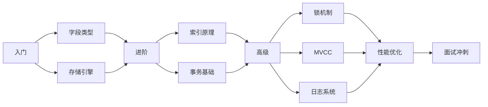

# MySQL 技术文档索引

## 📚 文档清单

本项目包含完整的 MySQL 技术文档体系，以下是所有 MySQL 相关文档的快速索引：

---

## 🎯 核心文档（4 篇）

#### 1. [01-MySQL 字段类型与存储引擎.md](./01-MySQL字段类型与存储引擎.md)

- **知识点：** 数值类型、字符串类型、日期时间类型、InnoDB/MyISAM/Memory/Archive
- **面试题：** 5 道
- **难度：** ⭐⭐⭐
- **适合人群：** 初级 ~ 中级

#### 2. [02-MySQL 索引原理详解.md](./02-MySQL索引原理详解.md)

- **知识点：** B+Tree、聚簇索引、二级索引、索引失效、索引优化
- **面试题：** 6 道
- **难度：** ⭐⭐⭐⭐⭐
- **适合人群：** 中级 ~ 高级

#### 3. [03-MySQL事务与锁机制详解.md](./03-MySQL事务与锁机制详解.md)

- **知识点：** ACID、隔离级别、MVCC、行锁算法、死锁处理
- **面试题：** 8 道
- **难度：** ⭐⭐⭐⭐⭐
- **适合人群：** 中级 ~ 高级

#### 4. [04-MySQL 日志与性能优化详解.md](./04-MySQL日志与性能优化详解.md)

- **知识点：** Redo/Bin/Undo Log、两阶段提交、EXPLAIN、SQL 优化
- **面试题：** 8 道
- **难度：** ⭐⭐⭐⭐⭐
- **适合人群：** 高级 ~ 架构师

---

## 📖 其他文档（5 篇）

#### 5. [05-MySQL索引与MVCC.md](./05-MySQL索引与MVCC.md)

- **简介：** 早期版本的索引与MVCC 讲解
- **状态：** ⚠️ 内容已整合到核心文档

#### 6. [06-MySQL事务-锁-优化详解.md](./06-MySQL事务-锁-优化详解.md)

- **简介：** 事务、锁和优化的综合讲解
- **状态：** ⚠️ 内容已拆分并扩充到独立文档

#### 7. [07-MySQL技术文档导航.md](./07-MySQL技术文档导航.md)

- **简介：** 总导航文档，快速了解整个 MySQL 文档体系
- **推荐：** ✅ 新手必读

#### 8. [08-MySQL事务隔离级别实战指南.md](./08-MySQL事务隔离级别实战指南.md) ⭐ NEW

- **简介：** MySQL 8 事务隔离级别完整实战指南
- **内容：** 四种隔离级别详细对比、并发问题演示、业务场景实战
- **特色：** ✅ 可执行 SQL 脚本 + ✅ 详细学习文档 + ✅ 高频面试题
- **推荐：** ✅ 面试冲刺必读

#### 9. [08-MySQL事务隔离级别实战演示.sql](./08-MySQL事务隔离级别实战演示.sql) ⭐ NEW

- **简介：** 配套的可执行 SQL 脚本，在 MySQL 8 中实际体验四种隔离级别
- **内容：** 脏读、不可重复读、幻读、Next-Key Lock 等完整演示
- **使用方式：** 在 MySQL 客户端打开两个会话，按注释步骤执行
- **推荐：** ✅ 动手实践必备

#### 10. [09-ShardingSphere整合实战指南.md](./09-ShardingSphere整合实战指南.md) ⭐ NEW

- **简介：** ShardingSphere-JDBC 分库分表完整实战指南
- **内容：** 环境搭建、自定义分片算法、MyBatis 集成、常见问题排查
- **特色：** ✅ 完整配置示例 + ✅ 可运行代码 + ✅ 调试技巧 + ✅ 最佳实践
- **技术栈：** ShardingSphere 4.1.1 + Spring Boot 2.7.18 + MyBatis
- **推荐：** ✅ 分库分表面试必读

---

## 💻 示例代码

### MySQLCorePrincipleDemo.java

- **路径：** `interview-service/src/main/java/cn/itzixiao/interview/mysql/`
- **功能：** 综合演示 MySQL 所有核心知识点
- **行数：** 617 行
- **模块数：** 8 个

**运行方式：**

```bash
mvn clean compile -pl interview-service -am
java cn.itzixiao.interview.mysql.MySQLCorePrincipleDemo
```

### MVCCDemo.java ⭐ NEW

- **路径：** `interview-microservices-parent/interview-service/src/main/java/cn/itzixiao/interview/mysql/`
- **功能：** MySQL MVCC(多版本并发控制) 详解
- **行数：** 315 行
- **模块数：** 6 个（MVCC 基础、Undo Log 版本链、Read View、隔离级别、锁关系、可见性算法）

**运行方式：**

```bash
mvn clean compile -pl interview-microservices-parent/interview-service -am
java cn.itzixiao.interview.mysql.MVCCDemo
```

### 08-MySQL事务隔离级别实战演示.sql ⭐ NEW

- **路径：** `docs/07-MySQL数据库/08-MySQL事务隔离级别实战演示.sql`
- **功能：** 在真实 MySQL 8 环境中体验四种隔离级别
- **内容：** 375 行完整 SQL 脚本，包含 10+ 个对比实验
- **使用方式：**
  ```sql
  -- 在 MySQL 客户端执行
  source docs/07-MySQL数据库/08-MySQL事务隔离级别实战演示.sql;
  -- 或复制 SQL 到两个会话窗口按步骤执行
  ```

### 09-ShardingSphere 整合实战指南.md ⭐ NEW

- **路径：** `docs/07-MySQL数据库/09-ShardingSphere 整合实战指南.md`
- **功能：** ShardingSphere-JDBC 分库分表完整整合教程
- **内容：** 555 行详细文档，包含环境准备、核心配置、分片算法实现、测试验证、常见问题
- **配套代码：**
    - `DeviceOperationLogMonthShardingAlgorithm.java` - 自定义分片算法（精确 + 范围）
    - `DeviceOperationLogMapper.java` - MyBatis Mapper 接口
    - `DeviceOperationLogMapper.xml` - MyBatis XML 映射文件
    - `application-dev.yml` - ShardingSphere 分片配置
- **使用方式：**
  ```bash
  # 编译项目
  mvn clean package -pl interview-microservices-parent/interview-provider -am -DskipTests
  
  # 启动服务
  java -jar interview-provider/target/interview-provider-1.0.0-SNAPSHOT.jar --spring.profiles.active=dev
  
  # 测试接口
  curl "http://localhost:8082/sharding/test/precise?time=2026-03-15T10:30"
  curl "http://localhost:8082/sharding/test/range?startTime=2026-01-01T00:00&endTime=2026-06-30T23:59"
  ```
- **推荐：** ✅ 分库分表实战必备

---

## 📖 推荐学习路线图



---

## 🔗 跨模块关联

### 前置知识

- ✅ **[Java基础](../01-Java基础/README.md)** - 数据类型、集合框架
- ✅ **[Java并发编程](../02-Java并发编程/README.md)** - 线程安全、锁机制

### 后续进阶

- 📚 **[Redis](../08-Redis 缓存/README.md)** - 缓存一致性、双写策略
- 📚 **[MyBatis](../09-中间件/README.md)** - ORM 框架使用
- 📚 **[分布式系统](../12-分布式系统/README.md)** - 分布式事务

### 知识点对应

| MySQL | 应用场景       |
|-------|------------|
| 索引优化  | 慢查询优化、覆盖索引 |
| 事务隔离  | 防止脏读、不可重复读 |
| MVCC  | 读写分离、高并发读取 |
| 锁机制   | 库存扣减、秒杀场景  |
| 日志系统  | 数据恢复、主从复制  |

---

## 🎓 分阶段学习建议

### 第一阶段：基础入门（1-2 天）

1. ✅ 阅读《MySQL 字段类型与存储引擎》
2. ✅ 理解不同字段类型的适用场景
3. ✅ 掌握 InnoDB 和 MyISAM 的区别
4. ✅ 完成 5 道基础面试题

### 第二阶段：索引精通（2-3 天）

1. ✅ 阅读《MySQL 索引原理详解》
2. ✅ 理解 B+Tree 数据结构
3. ✅ 掌握聚簇索引和二级索引
4. ✅ 熟悉索引失效的 7 大场景
5. ✅ 完成 6 道索引面试题

### 第三阶段：事务与锁（2-3 天）

1. ✅ 阅读《MySQL 事务与锁机制详解》
2. ✅ 理解 ACID 四大特性
3. ✅ 掌握四种隔离级别
4. ✅ 理解 MVCC 实现原理
5. ✅ 熟悉 InnoDB 行锁算法
6. ✅ 完成 8 道事务与锁面试题

### 第四阶段：性能优化（2-3 天）

1. ✅ 阅读《MySQL日志与性能优化详解》
2. ✅ 理解 Redo/Bin/Undo Log
3. ✅ 掌握两阶段提交
4. ✅ 学会使用 EXPLAIN 分析 SQL
5. ✅ 掌握 SQL 优化技巧
6. ✅ 完成 8 道性能优化面试题

### 第六阶段：实战演练（1-2 天）⭐ NEW

1. ✅ 阅读《MySQL事务隔离级别实战指南》
2. ✅ 执行 SQL 脚本体验四种隔离级别
3. ✅ 观察脏读、不可重复读、幻读现象
4. ✅ 理解 MVCC 和 Next-Key Lock 的作用
5. ✅ 完成业务场景模拟实验

### 第七阶段：分库分表实战（2-3 天）⭐ NEW

1. ✅ 阅读《ShardingSphere 整合实战指南》
2. ✅ 理解分库分表的基本概念和应用场景
3. ✅ 掌握 ShardingSphere-JDBC 的配置方法
4. ✅ 实现自定义分片算法（精确 + 范围）
5. ✅ 集成 MyBatis 进行数据访问
6. ✅ 学习分片路由调试技巧
7. ✅ 掌握常见问题排查方法

### 第八阶段：面试冲刺（1-2 天）

1. ✅ 复习 27+ 道高频面试题
2. ✅ 理解背后的原理
3. ✅ 结合实际场景思考
4. ✅ 模拟面试练习

---

## 🛠️ 实战技巧

### EXPLAIN 分析 SQL

```sql
EXPLAIN SELECT * FROM users WHERE email = 'test@example.com';
-- 关注：type、key、rows、Extra
```

### 创建复合索引

```sql
CREATE INDEX idx_name_age ON users(name, age);
-- 遵循最左匹配原则
```

### 优化深分页

```sql
-- 优化前
SELECT * FROM orders LIMIT 1000000, 10;

-- 优化后
SELECT * FROM orders o
INNER JOIN (SELECT id FROM orders LIMIT 1000000, 10) tmp
ON o.id = tmp.id;
```

---

## 🔥 高频面试题 Top 18

根据各大厂面试统计，以下是最高频的 MySQL 面试题：

**问题 1：InnoDB 和 MyISAM 的区别？** （出现频率：95%）

**答：**

| 特性 | InnoDB | MyISAM |
|------|--------|--------|
| **事务支持** | 支持 ACID | 不支持 |
| **行级锁** | 支持 | 仅支持表级锁 |
| **外键** | 支持 | 不支持 |
| **崩溃恢复** | 支持（Redo Log） | 不支持 |
| **索引类型** | 聚簇索引 | 非聚簇索引 |
| **全文索引** | 5.6+ 支持 | 原生支持 |
| **适用场景** | 高并发、事务场景 | 读多写少、日志分析 |

**核心区别总结：**

- **InnoDB**：支持事务、行锁、外键，适合高并发 OLTP 场景
- **MyISAM**：表锁、无事务，查询速度快，适合读密集型应用

---

**问题 2：为什么使用 B+Tree 作为索引？** （出现频率：90%）

**答：**

**B+Tree 的优势：**

1. **磁盘 IO 更少**
   - B+Tree 非叶子节点只存键值，不存数据，一个节点可存更多键
   - 树高更低，查询磁盘 IO 次数更少

2. **范围查询高效**
   - 叶子节点通过指针相连，范围查询只需顺序遍历
   - B-Tree 需要中序遍历，效率低

3. **查询性能稳定**
   - 所有数据都在叶子节点，查询路径长度相同
   - 不会出现某些查询特别慢的情况

4. **更适合磁盘存储**
   - 节点大小可设置为页大小（16KB），一次 IO 读取一个节点
   - 充分利用磁盘预读特性

**对比其他数据结构：**

- **Hash**：只能等值查询，不支持范围查询
- **B-Tree**：数据分散在各层，范围查询需回溯
- **红黑树**：树高太高，磁盘 IO 次数多

---

**问题 3：聚簇索引和二级索引的区别？** （出现频率：88%）

**答：**

| 特性 | 聚簇索引（Clustered Index） | 二级索引（Secondary Index） |
|------|---------------------------|---------------------------|
| **数据存储** | 叶子节点存完整行数据 | 叶子节点存主键值 |
| **数量限制** | 一张表只能有一个 | 可以有多个 |
| **索引键** | 主键（无主键则用唯一键/隐藏 row_id） | 任意列 |
| **查询方式** | 直接定位数据 | 先查主键，再回表查数据 |

**回表查询：**

```sql
-- 二级索引查询需要回表
SELECT * FROM user WHERE name = 'Alice';
-- 1. 在 name 索引找到主键 id
-- 2. 根据 id 到聚簇索引查完整数据
```

**覆盖索引避免回表：**

```sql
-- 只需 id 和 name，无需回表
SELECT id, name FROM user WHERE name = 'Alice';
```

---

**问题 4：什么是最左匹配原则？** （出现频率：85%）

**答：**

**最左匹配原则**：联合索引查询时，MySQL 从最左边的列开始匹配，遇到范围查询（>、<、BETWEEN、LIKE）则停止匹配。

**示例：**

```sql
-- 索引：INDEX idx_a_b_c (a, b, c)

-- ✅ 完全匹配
WHERE a = 1 AND b = 2 AND c = 3

-- ✅ 匹配 a 和 b（最左前缀）
WHERE a = 1 AND b = 2

-- ✅ 只匹配 a
WHERE a = 1

-- ❌ 不匹配（缺少 a）
WHERE b = 2 AND c = 3

-- ⚠️ 只匹配 a（b 是范围查询，c 无法使用索引）
WHERE a = 1 AND b > 2 AND c = 3
```

**原理：**

- 联合索引按列顺序排序，先按 a 排序，a 相同再按 b 排序
- 跳过最左列，后续列在索引中不是有序的，无法使用二分查找

---

**问题 5：什么是覆盖索引？** （出现频率：82%）

**答：**

**覆盖索引**：查询的所有列都在索引中，无需回表查询聚簇索引。

**示例：**

```sql
-- 表结构
CREATE TABLE user (
    id INT PRIMARY KEY,
    name VARCHAR(50),
    age INT,
    INDEX idx_name_age (name, age)
);

-- ✅ 覆盖索引查询
SELECT name, age FROM user WHERE name = 'Alice';
-- name 和 age 都在 idx_name_age 索引中，无需回表

-- ❌ 非覆盖索引（需要回表）
SELECT name, age, phone FROM user WHERE name = 'Alice';
-- phone 不在索引中，需要回表查完整数据
```

**优势：**

1. **减少 IO**：避免回表查询
2. **减少随机 IO**：索引是有序的，顺序读取更高效
3. **提高缓存命中率**：索引页通常比数据页小，可缓存更多

---

**问题 6：索引失效的场景有哪些？** （出现频率：80%）

**答：**

| 场景 | 示例 | 原因 |
|------|------|------|
| **对索引列做运算** | `WHERE age + 1 = 18` | 破坏索引有序性 |
| **使用函数** | `WHERE YEAR(create_time) = 2024` | 无法使用索引 |
| **隐式类型转换** | `WHERE user_id = '123'`（int 类型） | 类型不匹配 |
| **LIKE 以 % 开头** | `WHERE name LIKE '%abc'` | 无法前缀匹配 |
| **OR 条件** | `WHERE a = 1 OR b = 2`（b 无索引） | 可能全表扫描 |
| **NOT、<>、!=** | `WHERE age != 18` | 范围太广 |
| **IS NULL 判断** | `WHERE name IS NULL` | 可能不走索引 |
| **违背最左前缀** | `WHERE b = 2`（索引是 a,b） | 缺少最左列 |

**优化建议：**

- 避免对索引列使用函数，可在应用层处理
- 使用 `UNION ALL` 替代 `OR`
- 使用覆盖索引减少回表

---

**问题 7：MySQL 如何保证 ACID？** （出现频率：78%）

**答：**

| ACID 特性 | 实现机制 |
|----------|---------|
| **原子性（Atomicity）** | Undo Log（回滚日志） |
| **一致性（Consistency）** | 约束检查、触发器、存储过程 |
| **隔离性（Isolation）** | MVCC + 锁机制 |
| **持久性（Durability）** | Redo Log（重做日志）+ Binlog |

**详细说明：**

1. **原子性**：事务中的操作要么全部成功，要么全部失败。通过 Undo Log 记录修改前的数据，失败时回滚。

2. **隔离性**：通过 MVCC 实现读已提交和可重复读，通过锁机制防止写写冲突。

3. **持久性**：事务提交后，修改永久保存。Redo Log 保证崩溃恢复，Binlog 用于主从复制。

4. **一致性**：数据库通过约束（主键、外键、唯一约束）保证数据完整性。

---

**问题 8：脏读、不可重复读、幻读的区别？** （出现频率：75%）

**答：**

| 问题 | 定义 | 发生条件 |
|------|------|---------|
| **脏读** | 读到其他事务未提交的数据 | 读未提交隔离级别 |
| **不可重复读** | 同一事务两次读取，数据被其他事务修改 | 读已提交隔离级别 |
| **幻读** | 同一事务两次查询，结果集行数不同 | 可重复读隔离级别（部分解决） |

**示例：**

```sql
-- 脏读
事务 A：UPDATE user SET age = 20 WHERE id = 1;  -- 未提交
事务 B：SELECT age FROM user WHERE id = 1;       -- 读到 20（脏读）

-- 不可重复读
事务 A：SELECT age FROM user WHERE id = 1;       -- 读到 18
事务 B：UPDATE user SET age = 20 WHERE id = 1;   -- 提交
事务 A：SELECT age FROM user WHERE id = 1;       -- 读到 20（不可重复读）

-- 幻读
事务 A：SELECT * FROM user WHERE age > 18;       -- 读到 3 条
事务 B：INSERT INTO user VALUES (null, 25);      -- 提交
事务 A：SELECT * FROM user WHERE age > 18;       -- 读到 4 条（幻读）
```

---

**问题 9：什么是 MVCC？如何实现？** （出现频率：72%）

**答：**

**MVCC（Multi-Version Concurrency Control）**：多版本并发控制，通过保存数据的历史版本，实现读操作不加锁，提高并发性能。

**实现原理：**

**1. 隐藏字段：**

每行记录有两个隐藏字段：
- `DB_TRX_ID`：最后修改该记录的事务 ID
- `DB_ROLL_PTR`：回滚指针，指向 Undo Log

**2. Undo Log 版本链：**

```
当前记录 ──► 上一个版本 ──► 再上一个版本 ──► ...
```

**3. Read View（读视图）：**

事务快照读时生成 Read View，包含：
- `creator_trx_id`：创建该视图的事务 ID
- `m_ids`：活跃事务 ID 列表
- `min_trx_id`：最小活跃事务 ID
- `max_trx_id`：下一个分配的事务 ID

**可见性判断规则：**

- `DB_TRX_ID` == `creator_trx_id`：可见（自己修改的）
- `DB_TRX_ID` < `min_trx_id`：可见（已提交）
- `DB_TRX_ID` >= `max_trx_id`：不可见（未来事务）
- `min_trx_id` <= `DB_TRX_ID` < `max_trx_id`：不在 `m_ids` 中则可见

---

**问题 10：InnoDB 的行锁算法有哪些？** （出现频率：70%）

**答：**

| 锁类型 | 定义 | 使用场景 |
|--------|------|---------|
| **Record Lock** | 锁定单个记录 | 精确匹配查询 |
| **Gap Lock** | 锁定索引间隙，不包含记录本身 | 防止幻读 |
| **Next-Key Lock** | Record Lock + Gap Lock | 默认行锁算法 |
| **Insert Intention Lock** | 插入意向锁 | 插入操作 |

**Next-Key Lock 示例：**

```sql
-- 表中有记录：id = 1, 5, 10
-- 事务执行：
SELECT * FROM user WHERE id = 5 FOR UPDATE;

-- 加锁范围：(1, 5] 和 (5, 10]
-- 即：id 在 1 到 10 之间的间隙和记录都被锁定
```

**锁的兼容性：**

|  | 共享锁(S) | 排他锁(X) |
|--|----------|----------|
| 共享锁(S) | 兼容 | 冲突 |
| 排他锁(X) | 冲突 | 冲突 |

---

**问题 11：Redo Log 和 Binlog 的区别？** （出现频率：68%）

**答：**

| 特性 | Redo Log | Binlog |
|------|---------|--------|
| **层级** | InnoDB 存储引擎层 | MySQL Server 层 |
| **内容** | 物理日志（页修改） | 逻辑日志（SQL 语句/行数据） |
| **用途** | 崩溃恢复 | 主从复制、数据恢复 |
| **写入方式** | 循环写（固定大小） | 追加写 |
| **文件数** | 固定（ib_logfile0/1） | 多个，可配置保留 |

**协作流程（两阶段提交）：**

```
1. 事务执行，修改 Buffer Pool 中的页
2. 写 Redo Log（prepare 状态）
3. 写 Binlog
4. 提交事务，Redo Log 改为 commit 状态
```

**为什么需要两种日志？**

- **Redo Log**：保证崩溃恢复时数据不丢失（持久性）
- **Binlog**：用于主从复制和数据归档

---

**问题 12：什么是两阶段提交？** （出现频率：65%）

**答：**

**两阶段提交（2PC）**：保证 Redo Log 和 Binlog 的一致性，用于崩溃恢复。

**执行流程：**

```
阶段一（Prepare）：
    1. 写入 Redo Log（标记为 prepare）
    2. 写入 Binlog

阶段二（Commit）：
    3. Redo Log 标记为 commit
    4. 事务完成
```

**崩溃恢复场景：**

| 崩溃时机 | 处理方式 |
|---------|---------|
| Prepare 之前 | 回滚事务 |
| Prepare 之后，Commit 之前 | 对比 Binlog，存在则提交，不存在则回滚 |
| Commit 之后 | 正常完成 |

**为什么需要两阶段提交？**

- 如果只写 Redo Log，主库崩溃恢复后，从库没有这条记录，导致主从不一致
- 如果只写 Binlog，主库崩溃后无法恢复内存中的数据
- 两阶段提交确保两份日志要么都成功，要么都失败

---

**问题 13：如何分析一条 SQL 的性能？** （出现频率：62%）

**答：**

**1. 使用 EXPLAIN 分析执行计划：**

```sql
EXPLAIN SELECT * FROM user WHERE name = 'Alice';
```

**关键字段：**

| 字段 | 含义 | 优化建议 |
|------|------|---------|
| `type` | 访问类型 | 至少达到 range，最好是 ref/const |
| `key` | 使用的索引 | 确认是否使用预期索引 |
| `rows` | 扫描行数 | 越小越好 |
| `Extra` | 额外信息 | 避免 Using filesort、Using temporary |

**2. 使用 SHOW PROFILE：**

```sql
SET profiling = 1;
SELECT * FROM user WHERE ...;
SHOW PROFILES;
SHOW PROFILE FOR QUERY 1;
```

**3. 使用 Performance Schema：**

```sql
-- 查看慢查询
SELECT * FROM performance_schema.events_statements_summary_by_digest
ORDER BY SUM_TIMER_WAIT DESC LIMIT 10;
```

**4. 慢查询日志：**

```ini
[mysqld]
slow_query_log = 1
long_query_time = 2
```

---

**问题 14：SQL 优化有哪些常见手段？** （出现频率：60%）

**答：**

**1. 索引优化：**

- 为 WHERE、ORDER BY、GROUP BY 字段加索引
- 使用覆盖索引减少回表
- 避免索引失效（函数、类型转换、LIKE '%x'）

**2. 查询优化：**

```sql
-- 避免 SELECT *
SELECT id, name FROM user WHERE ...;

-- 小表驱动大表
SELECT * FROM small_table s 
JOIN large_table l ON s.id = l.sid;

-- 用 UNION ALL 替代 OR
SELECT * FROM user WHERE id = 1
UNION ALL
SELECT * FROM user WHERE id = 2;
```

**3. 表结构优化：**

- 使用合适的数据类型（INT vs BIGINT，VARCHAR 长度）
- 避免 NULL（用默认值替代）
- 垂直拆分宽表

**4. 架构优化：**

- 读写分离
- 分库分表
- 引入缓存（Redis）

---

**问题 15：深分页如何优化？** （出现频率：58%）

**答：**

**深分页问题：**

```sql
-- 传统分页，越往后越慢
SELECT * FROM user ORDER BY id LIMIT 1000000, 10;
-- 需要扫描 1000010 行，只返回 10 行
```

**优化方案：**

**1. 游标分页（推荐）：**

```sql
-- 记录上次查询的最大 id
SELECT * FROM user WHERE id > 1000000 ORDER BY id LIMIT 10;
-- 走索引，效率高
```

**2. 延迟关联：**

```sql
SELECT u.* FROM user u
JOIN (SELECT id FROM user ORDER BY id LIMIT 1000000, 10) tmp
ON u.id = tmp.id;
-- 子查询只查 id（覆盖索引），再关联查完整数据
```

**3. 业务限制：**

- 限制最大页码（如只能查看前 100 页）
- 使用搜索替代翻页

**对比：**

| 方案 | 优点 | 缺点 |
|------|------|------|
| 游标分页 | 性能最好 | 无法跳页 |
| 延迟关联 | 可跳页 | 仍有一定开销 |
| 业务限制 | 简单有效 | 用户体验受限 |

---

**问题 16：四种事务隔离级别的区别？** ⭐ NEW（出现频率：55%）

**答：**

| 隔离级别 | 脏读 | 不可重复读 | 幻读 | 实现机制 |
|---------|------|-----------|------|---------|
| **读未提交（RU）** | ✗ | ✗ | ✗ | 不加锁，直接读最新 |
| **读已提交（RC）** | ✓ | ✗ | ✗ | MVCC（每次查询新 Read View） |
| **可重复读（RR）** | ✓ | ✓ | 部分✓ | MVCC（事务开始时 Read View）+ Gap Lock |
| **串行化（S）** | ✓ | ✓ | ✓ | 所有操作加锁 |

**MySQL 默认隔离级别：可重复读（Repeatable Read）**

**设置隔离级别：**

```sql
-- 查看
SELECT @@transaction_isolation;

-- 设置会话级别
SET SESSION TRANSACTION ISOLATION LEVEL READ COMMITTED;
```

---

**问题 17：MySQL 如何解决幻读问题？** ⭐ NEW（出现频率：52%）

**答：**

**幻读**：同一事务两次相同条件查询，结果集行数不同（被其他事务插入/删除）。

**MySQL 的解决方案：**

**1. 快照读（Snapshot Read）- MVCC：**

```sql
SELECT * FROM user WHERE age > 18;  -- 普通查询
```

- 基于 Read View 读取历史版本，看不到其他事务的新插入
- **解决幻读**：事务内多次查询结果一致

**2. 当前读（Current Read）- Next-Key Lock：**

```sql
SELECT * FROM user WHERE age > 18 FOR UPDATE;  -- 加锁查询
```

- 对查询范围内的记录和间隙加锁（Next-Key Lock）
- 阻止其他事务在范围内插入新记录
- **解决幻读**：阻塞插入操作

**注意：**

- MVCC 解决的是**快照读的幻读**
- Next-Key Lock 解决的是**当前读的幻读**
- 如果先快照读后当前读，仍可能出现幻读（两次读取方式不同）

---

**问题 18：Next-Key Lock 的作用和原理？** ⭐ NEW（出现频率：48%）

**答：**

**Next-Key Lock** = Record Lock（记录锁）+ Gap Lock（间隙锁）

**作用：**

1. **防止幻读**：锁定记录及其前面的间隙，阻止其他事务插入
2. **保证可重复读**：事务内多次当前读结果一致

**原理：**

```
索引记录：10, 20, 30

Next-Key Lock 范围：
(-∞, 10], (10, 20], (20, 30], (30, +∞)

-- 查询 WHERE id = 20 FOR UPDATE
-- 加锁范围：(10, 20] 和 (20, 30]
-- 即 id 在 10 到 30 之间的记录和间隙都被锁定
```

**加锁规则（RR 隔离级别）：**

1. 唯一索引等值查询且记录存在：退化为 Record Lock
2. 唯一索引等值查询且记录不存在：Gap Lock
3. 唯一索引范围查询：Next-Key Lock
4. 非唯一索引：Next-Key Lock

**示例：**

```sql
-- 表结构：id 主键，age 普通索引
-- 数据：id=1(age=10), id=5(age=20), id=10(age=30)

SELECT * FROM user WHERE age = 20 FOR UPDATE;
-- 加锁范围：(10, 20] 和 (20, 30)
-- 锁定 age=20 的记录，以及 age 在 (10, 30) 的间隙
```

---

## 📝 配套资源

### 官方文档

- [MySQL 8.0 Reference Manual](https://dev.mysql.com/doc/refman/8.0/en/)
- [InnoDB Storage Engine](https://dev.mysql.com/doc/refman/8.0/en/innodb-storage-engine.html)

### 实践工具

- **MySQL Workbench** - 可视化管理工具
- **Percona Toolkit** - 高性能运维工具集
- **pt-query-digest** - 慢查询分析
- **mysqltuner.pl** - 性能调优建议

### 推荐书籍

- 《高性能 MySQL》⭐⭐⭐⭐⭐
- 《MySQL 技术内幕：InnoDB 存储引擎》⭐⭐⭐⭐⭐
- 《深入理解 MySQL 主从复制》⭐⭐⭐⭐

---

## 🚀 快速查阅表

| 主题     | 查看文档                                                   | 关键知识点                                            | 面试题数  |
|--------|--------------------------------------------------------|--------------------------------------------------|-------|
| 字段类型   | [字段类型与存储引擎](./MySQL字段类型与存储引擎.md)                       | DECIMAL、CHAR vs VARCHAR、DATETIME                 | 5     |
| 存储引擎   | [字段类型与存储引擎](./MySQL字段类型与存储引擎.md)                       | InnoDB、MyISAM、特性对比                               | 5     |
| 索引结构   | [索引原理详解](./MySQL索引原理详解.md)                             | B+Tree、聚簇索引、二级索引                                 | 6     |
| 索引优化   | [索引原理详解](./MySQL索引原理详解.md)                             | 失效场景、覆盖索引、最左匹配                                   | 6     |
| 事务特性   | [事务与锁机制详解](./MySQL事务与锁机制详解.md)                         | ACID、隔离级别、并发问题                                   | 8     |
| MVCC   | [事务与锁机制详解](./MySQL事务与锁机制详解.md)                         | 隐藏列、版本链、Read View                                | 8     |
| 锁机制    | [事务与锁机制详解](./MySQL事务与锁机制详解.md)                         | 行锁算法、共享锁、排他锁、死锁                                  | 8     |
| 日志系统   | [日志与性能优化详解](./MySQL日志与性能优化详解.md)                       | Redo/Bin/Undo、两阶段提交                              | 8     |
| 性能优化   | [日志与性能优化详解](./MySQL日志与性能优化详解.md)                       | EXPLAIN、SQL 优化、表优化                               | 8     |
| 事务隔离级别 | [事务隔离级别实战指南](./08-MySQL事务隔离级别实战指南.md)                  | 四种隔离级别、并发问题、MVCC                                 | ⭐ NEW |
| 实战演示   | [事务隔离级别实战演示](./08-MySQL事务隔离级别实战演示.sql)                 | 可执行 SQL、对比实验                                     | ⭐ NEW |
| 分库分表   | [ShardingSphere 整合实战指南](./09-ShardingSphere 整合实战指南.md) | ShardingSphere-JDBC、自定义分片算法、actual-data-nodes 配置 | ⭐ NEW |

---

## 💡 学习建议

1. **循序渐进**：按阶段逐步深入，不要跳跃式学习
2. **理论结合实践**：边学边练，动手实验
3. **画图理解**：B+Tree、MVCC 等复杂概念多画图
4. **面试导向**：重点掌握 27 道高频面试题
5. **定期复习**：周期性回顾，加深记忆
6. **总结归纳**：做笔记，形成自己的知识体系

---

## 📈 更新日志

### v2.2 -2026-03-12 ⭐ NEW

- ✅ 新增《ShardingSphere 整合实战指南》文档（555 行）
- ✅ 新增 ShardingSphere-JDBC 分库分表完整实战教程
- ✅ 新增自定义分片算法实现（精确分片 + 范围分片）
- ✅ 新增 MyBatis XML 映射文件集成示例
- ✅ 新增 actual-data-nodes 配置规范（解决表名格式不匹配问题）
- ✅ 新增分片路由调试技巧（DEBUG 日志跟踪）
- ✅ 新增常见问题解决方案（no table route info 等）
- ✅ 新增生产环境最佳实践（索引优化、连接池配置、SQL 监控）

### v2.1 -2026-03-11 ⭐ NEW

- ✅ 新增《MySQL事务隔离级别实战指南》文档（662 行）
- ✅ 新增《MySQL事务隔离级别实战演示》SQL 脚本（375 行）
- ✅ 新增 MVCCDemo.java 示例代码（315 行）
- ✅ 新增三种隔离级别的完整对比实验
- ✅ 新增脏读、不可重复读、幻读的实际演示
- ✅ 新增业务场景模拟（库存扣减、转账场景）
- ✅ 新增 3 道高频面试题

### v2.0 - 2026-03-07

- ✅ 新增 4 篇核心文档
- ✅ 新增 27 道高频面试题
- ✅ 新增示例代码 MySQLCorePrincipleDemo.java
- ✅ 新增学习路线图
- ✅ 新增快速查阅表

### v1.0 - 早期版本

- ✅ 基础 MySQL 文档
- ✅ 索引与 MVCC 初步讲解
- ✅ 事务与锁基础

---

## 🎯 下一步计划

- [ ] 增加 SQL 实战案例
- [ ] 补充主从复制详解
- [ ] 添加分库分表方案 ✅ 已完成
- [ ] 完善性能监控体系
- [ ] 故障排查手册

---

**维护者：** itzixiao  
**最后更新：** 2026-03-11  
**问题反馈：** 欢迎提 Issue 或 PR
