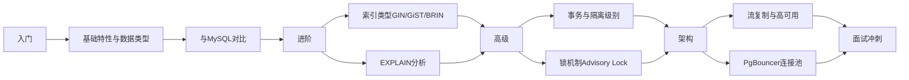

# PostgreSQL 技术文档索引

## 📚 文档清单

本模块包含 PostgreSQL 完整知识体系，覆盖基础特性、索引优化、事务锁机制与高可用架构。

---

## 🎯 核心文档（3 篇）

#### 1. [01-PostgreSQL基础与核心特性.md](./01-PostgreSQL基础与核心特性.md)

- **知识点：** PostgreSQL vs MySQL 对比、数据类型（JSONB/数组/UUID）、六种索引类型
- **面试题：** 6 道
- **难度：** ⭐⭐⭐
- **适合人群：** 初级 ~ 中级

#### 2. [02-PostgreSQL索引与查询优化.md](./02-PostgreSQL索引与查询优化.md)

- **知识点：** EXPLAIN ANALYZE 解读、覆盖索引、深分页优化、CTE、窗口函数、批量操作
- **面试题：** 3 道
- **难度：** ⭐⭐⭐⭐
- **适合人群：** 中级 ~ 高级

#### 3. [03-PostgreSQL事务锁与高可用.md](./03-PostgreSQL事务锁与高可用.md)

- **知识点：** SSI 串行化、DDL 事务、Advisory Lock、流复制、Patroni、PgBouncer
- **面试题：** 3 道
- **难度：** ⭐⭐⭐⭐⭐
- **适合人群：** 高级 ~ 架构师

---

## 📖 推荐学习路线



---

## 🔥 高频面试题 Top 12

根据各大厂面试统计，以下是最高频的 PostgreSQL 面试题：

**问题 1：PostgreSQL 和 MySQL 的主要区别？** （出现频率：92%）

**答：**

| 维度        | PostgreSQL                    | MySQL               |
|-----------|-------------------------------|---------------------|
| **SQL 标准** | 严格遵循                          | 较多扩展方言              |
| **DDL 事务** | ✅ 支持回滚                        | ❌ 不支持              |
| **数据类型**  | JSONB、数组、hstore、几何类型          | 以基础类型为主             |
| **索引类型**  | B-Tree/Hash/GIN/GiST/BRIN    | B+Tree 为主           |
| **MVCC**  | 旧版本存储在数据文件中                   | Undo Log 链表         |
| **适用场景**  | 复杂查询、GIS、金融、OLAP              | Web 应用、高速简单读写       |

---

**问题 2：JSONB 和 JSON 的区别？** （出现频率：88%）

**答：**

| 对比项    | JSON          | JSONB                           |
|--------|---------------|---------------------------------|
| **存储方式** | 原文本存储，保留键顺序   | 解析后二进制存储，自动去重                   |
| **索引支持** | ❌ 不支持        | ✅ 支持 GIN 索引                     |
| **查询性能** | 读取快（原样返回）     | 写入稍慢，查询更快                       |
| **操作符**  | 有限            | 丰富（`@>`, `?`, `?\|`, `?&` 等） |
| **推荐场景** | 仅存储，不做查询      | **需要查询/索引时使用（推荐）**              |

---

**问题 3：PostgreSQL 有哪些特有的索引类型？** （出现频率：85%）

**答：**

| 索引类型      | 适用场景                       | 特点            |
|-----------|----------------------------|--------------|
| **GIN**   | JSONB、数组、全文检索（tsvector）   | 倒排索引，读快写慢     |
| **GiST**  | 几何类型、范围类型（PostGIS）         | 广义搜索树，实时更新    |
| **BRIN**  | 超大表有序列（时序数据、日志表）           | 存储开销极小        |
| **部分索引** | 只索引满足条件的行                  | 节省空间，提升过滤精度   |
| **表达式索引** | 对函数/表达式结果建索引，如 `lower(email)` | 支持函数查询走索引 |

---

**问题 4：什么是 VACUUM？为什么 PostgreSQL 需要它？** （出现频率：82%）

**答：**

PostgreSQL 的 MVCC 机制在 UPDATE/DELETE 时不直接删除旧行，而是将其标记为"死元组（dead tuple）"。`VACUUM` 用于回收这些死元组占用的空间。

| 类型               | 说明                             |
|------------------|--------------------------------|
| `VACUUM`         | 清理死元组，不锁表，不归还 OS 空间           |
| `VACUUM FULL`    | 重建表文件，归还 OS 空间，**需要排他锁**      |
| `AUTOVACUUM`     | 后台自动触发，**生产必须开启**             |
| `VACUUM ANALYZE` | 同时清理死元组 + 更新统计信息              |

**注意：** MySQL 通过 Purge 线程自动清理 Undo Log，无需手动介入；PostgreSQL 需要合理配置 autovacuum 参数。

---

**问题 5：PostgreSQL 的 REPEATABLE READ 和 MySQL 有何不同？** （出现频率：80%）

**答：**

| 对比项     | PostgreSQL REPEATABLE READ         | MySQL REPEATABLE READ              |
|---------|------------------------------------|------------------------------------|
| **幻读防止** | ✅ 已防止（基于 MVCC 事务快照）               | ⚠️ 部分防止（需额外 Gap Lock 才能完全防止）    |
| **实现机制** | 事务开始时生成快照，整个事务内快照不变              | 事务开始时生成 Read View，配合 Gap Lock     |
| **严格程度** | 比 SQL 标准更严格                       | 符合 SQL 标准                         |

**结论：** PostgreSQL 的 `REPEATABLE READ` 在并发一致性上更强，无需 Gap Lock 即可防幻读。

---

**问题 6：Advisory Lock 是什么？如何实现分布式锁？** （出现频率：75%）

**答：**

Advisory Lock（咨询锁）是 PostgreSQL 提供的应用级锁，无需额外组件即可实现分布式锁。

```sql
-- 事务级咨询锁（推荐，事务结束自动释放）
BEGIN;
SELECT pg_advisory_xact_lock(hashKey);
-- 执行业务逻辑
COMMIT;  -- 自动释放锁

-- 非阻塞尝试获取（返回 true/false）
SELECT pg_try_advisory_xact_lock(hashKey);
```

**与 Redis 分布式锁对比：**

- **优势**：无需额外中间件，与数据库事务天然绑定
- **劣势**：仅适用于单 PG 实例，无法跨数据库集群

---

**问题 7：PostgreSQL 流复制和 MySQL Binlog 复制的区别？** （出现频率：72%）

**答：**

| 对比项     | PostgreSQL 流复制（WAL）        | MySQL Binlog 复制          |
|---------|---------------------------|--------------------------|
| **复制粒度** | 物理字节级（整个集群）               | 逻辑日志（SQL/行数据）            |
| **跨版本**  | ❌ 不支持                     | ✅ 支持（有限制）                |
| **延迟**   | 极低（物理流式传输）                | 略高（SQL 解析重放）             |
| **双向复制** | ❌ 不支持（需逻辑复制）               | ❌ 不原生支持                  |

**PG 逻辑复制**：支持表级复制、跨版本迁移，类似 MySQL Binlog Row 模式，适用于数据同步和异构迁移。

---

**问题 8：SKIP LOCKED 的使用场景？** （出现频率：70%）

**答：**

`SKIP LOCKED` 用于跳过已被其他事务锁定的行，核心应用场景是**任务队列多消费者并发消费**：

```sql
-- 多个 Worker 并发消费，互不干扰
SELECT * FROM task_queue
WHERE status = 'pending'
ORDER BY priority DESC, created_at ASC
LIMIT 5
FOR UPDATE SKIP LOCKED;
```

**优势：** 多 Worker 同时取任务不会互相等待，也不会重复消费同一条任务，实现高效并发。

---

**问题 9：如何优化 PostgreSQL 的深分页？** （出现频率：68%）

**答：**

```sql
-- ❌ 传统 OFFSET 深分页，越往后越慢
SELECT * FROM orders ORDER BY id LIMIT 10 OFFSET 1000000;

-- ✅ 方案一：游标分页（Keyset Pagination，推荐）
SELECT * FROM orders WHERE id > last_id ORDER BY id LIMIT 10;

-- ✅ 方案二：延迟关联（子查询走覆盖索引）
SELECT o.* FROM orders o
JOIN (SELECT id FROM orders ORDER BY id LIMIT 10 OFFSET 1000000) t
ON o.id = t.id;
```

| 方案      | 优点         | 缺点         |
|---------|------------|------------|
| 游标分页    | 性能最优，O(1)  | 无法跳页       |
| 延迟关联    | 可任意跳页      | 仍有一定 OFFSET 开销 |

---

**问题 10：PgBouncer 的 transaction 模式和 session 模式区别？** （出现频率：65%）

**答：**

| 模式            | 连接归还时机   | 并发能力 | 限制                                  |
|---------------|----------|------|-------------------------------------|
| `transaction` | 事务结束归还   | 极高   | 不支持 `SET` 会话变量、`LISTEN/NOTIFY` 等  |
| `session`     | 会话断开才归还  | 低    | 支持所有会话级特性                           |
| `statement`   | 语句结束归还   | 最高   | 不支持事务，使用场景极少                        |

**生产推荐：** 使用 `transaction` 模式，配合 `default_pool_size = 100`，可支撑数千并发连接。

---

**问题 11：什么是 SSI（可串行化快照隔离）？** （出现频率：60%）

**答：**

SSI（Serializable Snapshot Isolation）是 PostgreSQL `SERIALIZABLE` 隔离级别的实现机制。

**核心思想：** 不依赖锁，而是通过追踪事务间的**读写依赖关系**，检测到可能导致不可串行化的冲突时，终止其中一个事务并报错。

**与传统串行化对比：**

| 对比项     | SSI（PostgreSQL）         | 锁串行化（传统）    |
|---------|--------------------------|-------------|
| **实现方式** | 冲突检测（乐观）                 | 全程加锁（悲观）    |
| **并发性能** | 高（无冲突时无阻塞）               | 低（大量锁等待）    |
| **失败方式** | 事务报错需重试                  | 事务排队等待      |

---

**问题 12：实际项目中为什么选择 PostgreSQL 而不是 MySQL？** （出现频率：78%）

**答：**

这是一道典型的技术选型题，需结合**业务场景**来回答，不能简单说"PG 更好"。

**选择 PostgreSQL 的典型场景：**

**1. 数据模型复杂，JSON 半结构化存储需求高**

```sql
-- 商品 SKU 属性动态扩展，无需改表结构
CREATE TABLE products (
    id BIGSERIAL PRIMARY KEY,
    name TEXT,
    attributes JSONB  -- 支持 GIN 索引，按属性高效查询
);
CREATE INDEX idx_attr ON products USING GIN (attributes);
SELECT * FROM products WHERE attributes @> '{"color": "红色", "size": "XL"}';
```

**2. 需要严格的 SQL 标准与复杂查询（窗口函数、CTE、递归）**

```sql
-- 统计每个用户最近一笔订单（MySQL 8.0 前无法优雅实现）
SELECT user_id, amount FROM (
    SELECT user_id, amount,
           ROW_NUMBER() OVER (PARTITION BY user_id ORDER BY created_at DESC) AS rn
    FROM orders
) t WHERE rn = 1;
```

**3. 地理空间数据（GIS）**

```sql
-- PostGIS 扩展，查询 5km 内的门店
SELECT name FROM stores
WHERE ST_DWithin(location, ST_MakePoint(116.4, 39.9)::geography, 5000);
```

**4. 需要 DDL 事务（零风险数据库变更）**

```sql
-- DDL 变更失败可回滚，不留垃圾状态
BEGIN;
ALTER TABLE orders ADD COLUMN remark TEXT;
CREATE INDEX idx_remark ON orders(remark);
-- 发现问题，直接回滚，表结构不变
ROLLBACK;
```

**5. 金融/保险等对数据一致性要求极高的场景**

- PostgreSQL SERIALIZABLE 使用 SSI，提供最强一致性保证
- 严格遵循 SQL 标准，不存在 MySQL 的隐式类型转换等"方言"陷阱

**仍选择 MySQL 的场景：**

| 场景               | 原因                              |
|------------------|---------------------------------|
| 简单 CRUD 的 Web 应用  | MySQL 生态更成熟，DBA 人才多，运维成本低       |
| 超高写入 TPS（亿级流水）   | MySQL 写入性能在简单场景下更优，VACUUM 无额外开销 |
| 团队技术栈以 MySQL 为主   | 切换数据库的迁移成本 > 技术收益               |
| 已有成熟 MySQL 分库分表方案 | ShardingSphere/MyCat 生态更完善      |

**一句话总结：** 业务简单、团队熟悉 MySQL 就用 MySQL；需要复杂查询、JSONB、GIS、强一致性时选 PostgreSQL。

---

## 🔗 跨模块关联

### 前置知识

- ✅ **[MySQL数据库](../08-MySQL数据库/README.md)** - SQL 基础、事务概念
- ✅ **[Java并发编程](../02-Java并发编程/README.md)** - 并发控制思想

### 后续进阶

- 📚 **[Redis缓存](../10-Redis缓存/README.md)** - 缓存与数据库配合
- 📚 **[分布式系统](../14-分布式系统/README.md)** - 分布式事务

### 知识点对应

| PostgreSQL 特性   | 对应 MySQL 概念              |
|-----------------|--------------------------|
| JSONB + GIN 索引  | JSON 列（索引支持有限）           |
| Advisory Lock   | 应用层分布式锁（Redis 实现）        |
| WAL             | Redo Log + Binlog         |
| VACUUM          | Purge 线程（自动清理 Undo Log） |
| 流复制            | 主从复制（Binlog）             |
| Patroni         | MHA / Orchestrator        |

---

## 📈 更新日志

### v1.1 - 2026-03-18

- ✅ 面试题格式统一为「**问题 N：** + **答：**」规范（对齐 MySQL 文档标准）
- ✅ 新增《问题 12：实际项目中为什么选择 PostgreSQL 而不是 MySQL》
- ✅ 各题补充结构化对比表与代码示例，信息密度提升
- ✅ Top 11 升级为 Top 12

### v1.0 - 2026-03-18

- ✅ 新增《PostgreSQL 基础与核心特性》（297 行）
- ✅ 新增《PostgreSQL 索引与查询优化》（274 行）
- ✅ 新增《PostgreSQL 事务锁与高可用》（339 行）
- ✅ 覆盖 11 道高频面试题
- ✅ PostgreSQL vs MySQL 完整对比

---

**维护者：** itzixiao  
**最后更新：** 2026-03-18（v1.1）  
**问题反馈：** 欢迎提 Issue 或 PR
